# Finly

[English](README.md) · [Español](README.es.md) · [Català](README.ca.md) · [Français](README.fr.md) · [Deutsch](README.de.md) · [Português](README.pt.md) · [Italiano](README.it.md)

**Finly** è un'app di finanza personale per tenere traccia di entrate e uscite. Annota quello che guadagni e spendi giorno per giorno, organizza tutto in più conti e categorie personalizzate, e capisci i tuoi soldi con grafici, filtri per periodo, etichette e commenti.

Tutto funziona **sul dispositivo**: i tuoi dati vivono in un database SQLite locale (sql.js + IndexedDB sul web), nulla esce dal telefono e non serve un account né un abbonamento.

| | |
|---|---|
| **Piattaforme** | iOS, Android e Web |
| **Versione** | 2.0.0 |
| **Lingue** | Inglese, Spagnolo, Catalano, Francese, Tedesco, Portoghese e Italiano |
| **Dati** | 100 % locali (SQLite su nativo, sql.js + IndexedDB sul web) |
| **Temi** | Scuro, Chiaro e Automatico (segue il sistema) |

## Funzionalità

- **Più conti** — crea, modifica ed elimina conti, ognuno con la propria icona, colore e saldo iniziale facoltativo. Un conto speciale **Totale** aggrega tutto.
- **Tracciamento di entrate e uscite** — aggiungi transazioni in un giorno specifico con importo, conto, categoria, etichette, commento e una foto facoltativa.
- **Categorie personalizzate** — scegli da una libreria di icone e colori, e crea le tue categorie di uscite e entrate.
- **Grafici** — grafico a ciambella con il totale al centro e grafico a barre impilate orizzontale, con una ripartizione per categorie che mostra le percentuali.
- **Filtri per periodo** — Giorno, Settimana, Mese, Anno e intervalli personalizzati con selettore calendario.
- **Tutte le transazioni** — filtri combinati: tipo, categorie (multiselezione), periodo, conto, etichette e ricerca con ordinamento per data o importo.
- **Etichette e commenti** — etichetta le transazioni e filtra per etichetta; gestisci tutti i commenti dell'app e applica modifiche o eliminazioni di massa a più transazioni contemporaneamente.
- **Foto** — allega una foto a una transazione dalla galleria su tutte le piattaforme (fotocamera su iOS e Android).
- **Azioni di massa** — multiseleziona ed elimina transazioni, etichette, commenti e categorie in una sola volta.
- **Backup dei dati** — esporta l'intero database come snapshot JSON e reimportalo quando vuoi.
- **Impostazioni** — tema, dimensione del testo, valuta, separatore decimale, lingua, primo giorno della settimana, forme delle icone, valori predefiniti di Inizio e di Aggiungi transazione, e opzioni di privacy per nascondere i saldi.
- **Calcolatrice integrata** — una piccola calcolatrice nella schermata di aggiunta transazione per calcolare gli importi.

## Screenshot

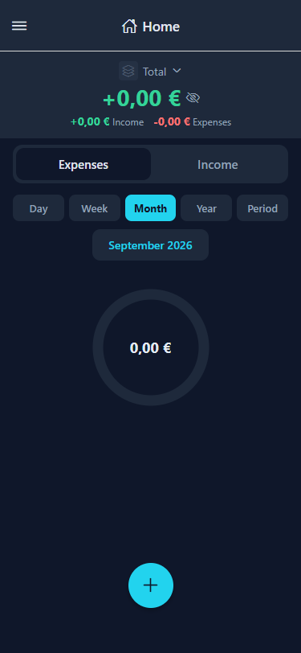<br>*Schermata iniziale prima di configurare qualsiasi conto.*<br><br>
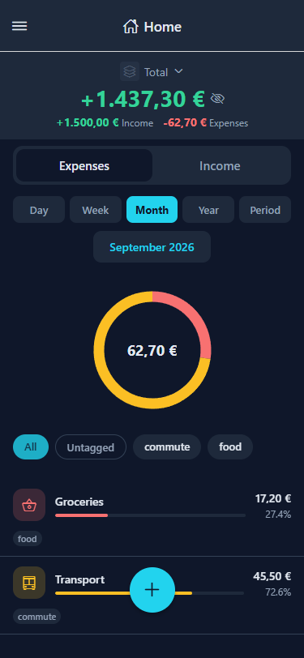<br>*Schermata iniziale con conti, grafico a ciambella e ripartizione per categorie.*<br><br>
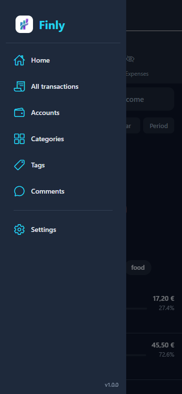<br>*Menu laterale con Home, Conti, Categorie, Etichette, Commenti, Tutte le transazioni e Impostazioni.*<br><br>
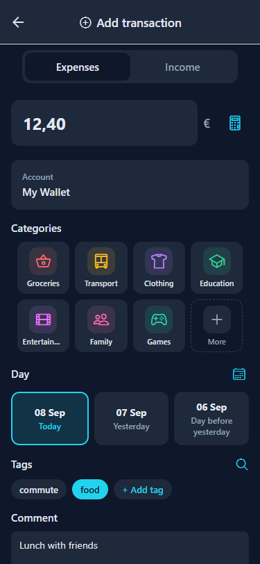<br>*Aggiungi un'uscita o un'entrata con importo, conto, categoria, giorno, etichette, commento e foto.*<br><br>
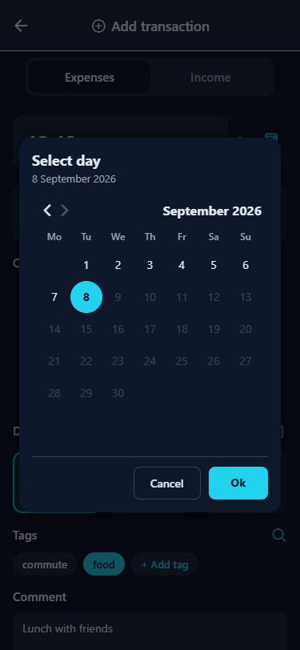<br>*Selettore calendario per scegliere un giorno, settimana, mese, anno o un intervallo di periodo personalizzato.*<br><br>
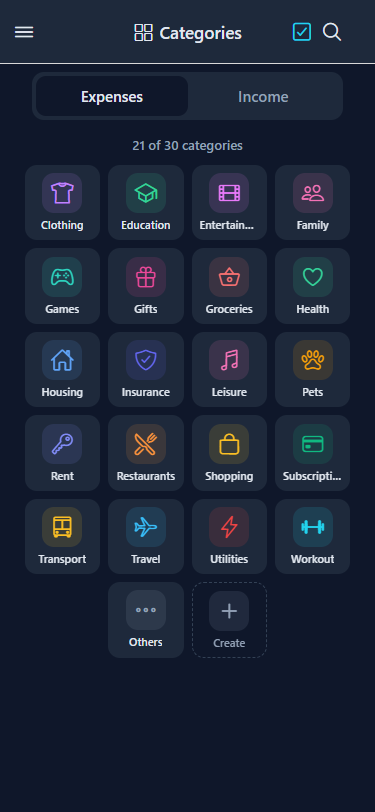<br>*Categorie organizzate per tipo (uscite/entrate) in una griglia 4×N.*<br><br>
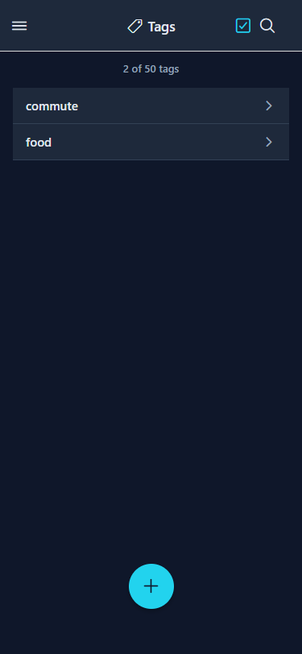<br>*Schermata delle etichette con ricerca e selezione di massa.*<br><br>
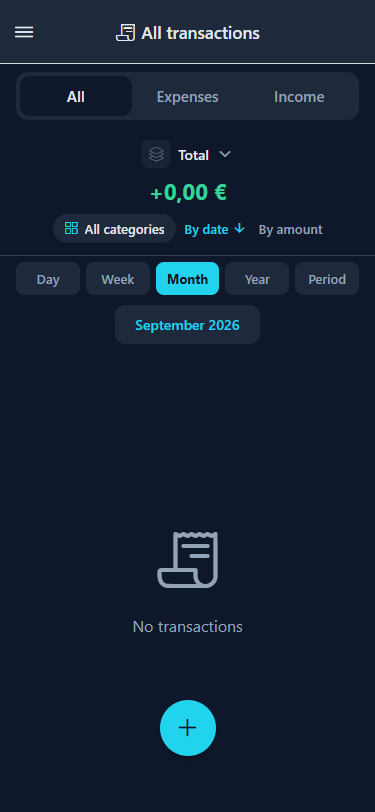<br>*Tutte le transazioni nello stato vuoto.*<br><br>
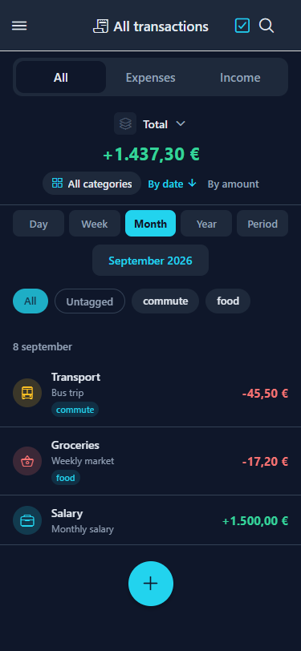<br>*Tutte le transazioni con filtri di tipo, categoria, periodo ed etichette, oltre a ordinamento e ricerca.*<br><br>
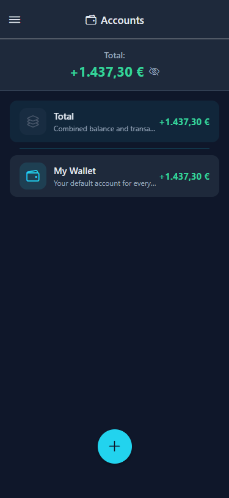<br>*Schermata dei conti con saldi e conto Totale aggregato.*<br><br>
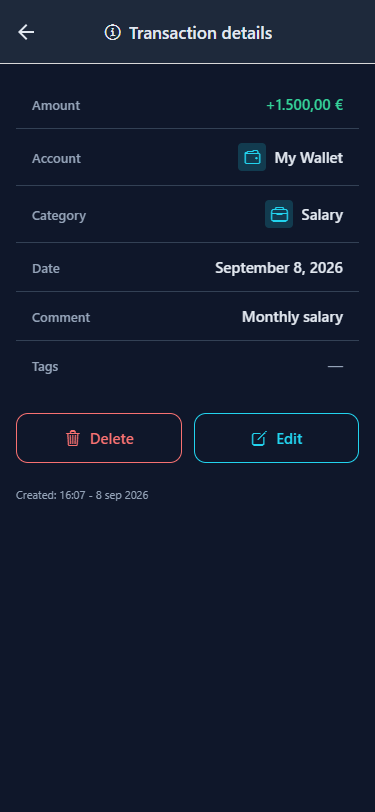<br>*Dettagli di una transazione di entrata con modifica ed eliminazione.*<br><br>
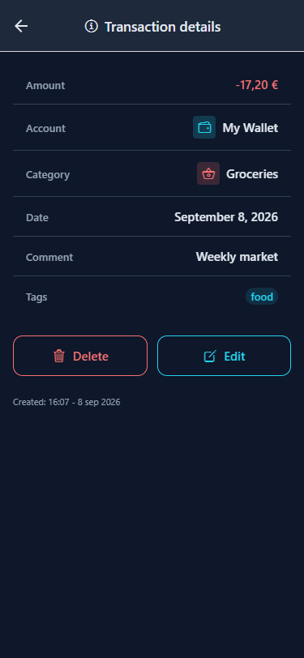<br>*Dettagli di una transazione di uscita con modifica ed eliminazione.*<br><br>
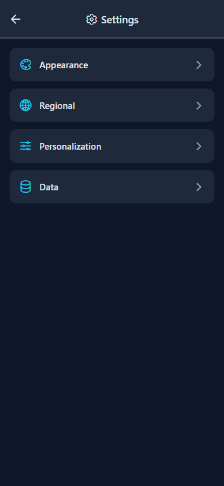<br>*Impostazioni: Aspetto, Regionali, Personalizzazione e Dati.*<br><br>
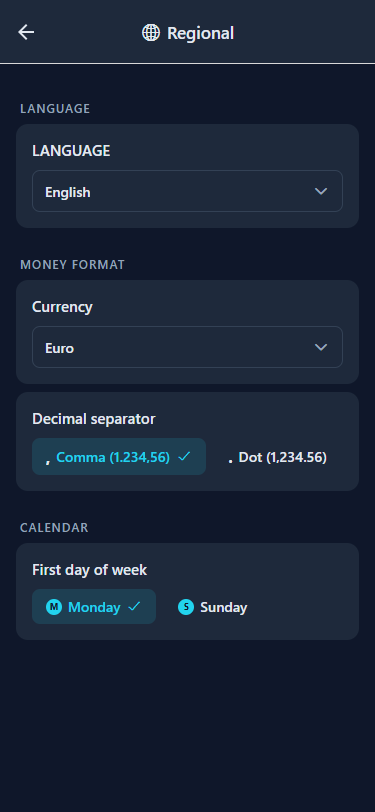<br>*Impostazioni regionali: lingua, valuta, separatore decimale e primo giorno della settimana.*<br><br>
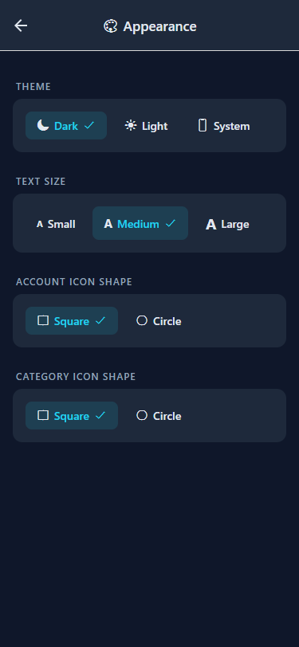<br>*Aspetto: tema, dimensione del testo e forme delle icone.*<br><br>
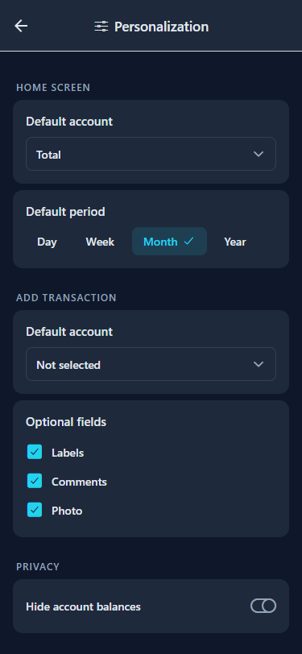<br>*Personalizzazione: valori predefiniti di Inizio e di Aggiungi transazione, e privacy.*<br><br>
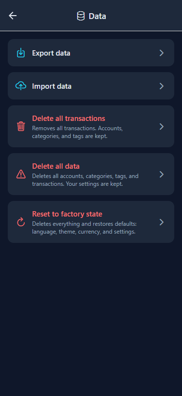<br>*Dati: esportazione/importazione del backup e azioni di eliminazione/reimpostazione.*<br><br>

## Stack tecnologico

| Livello | Tecnologia |
|---|---|
| Framework | React Native con Expo (SDK 57) |
| Linguaggio | TypeScript |
| Navigazione | React Navigation (Stack + Drawer) |
| Icone | @expo/vector-icons (Ionicons) |
| Grafici | react-native-svg |
| Selettore colore | reanimated-color-picker |
| Persistenza | SQLite (expo-sqlite) su nativo, sql.js (WASM) + IndexedDB sul web |
| ORM | Drizzle ORM (sqlite-proxy su un DatabaseHandle condiviso) |
| Validazione | Schemi Zod come unica fonte di verità per le righe salvate |
| Web | react-native-web |
| Stato | Context API (AppContext + ConfigContext) |
| i18n | Sistema interno (en, es, ca, fr, de, pt, it) |

## Sviluppo

Questa sezione è per chi contribuisce e per chiunque voglia eseguire, creare un fork o estendere l'app.

### Requisiti

- Node.js 20+ (consigliata Node 24)
- npm
- Un emulatore Android facoltativo (la cartella `android/` è generata dal CNG — vedi sotto)

### Prima volta dopo il clone

```bash
cd FinlyApp
npm install
npx expo start
```

Questo avvia Metro Bundler. Poi:

| Per vedere su… | Fai questo |
|---|---|
| **Browser** | Apri http://localhost:8081 oppure esegui `npx expo start --web` |
| **Android (emulatore)** | Esegui `npx expo run:android` |
| **iOS (simulatore)** | Esegui `npx expo run:ios` (solo macOS) |

### Comandi

| Comando | Descrizione |
|---|---|
| `npm start` | Avvia Expo in modalità sviluppo |
| `npm run web` | Avvia e apre nel browser |
| `npm run android` | Avvia sull'emulatore Android |
| `npm run ios` | Avvia sul simulatore iOS (solo macOS) |
| `npm run typecheck` | Verifica TypeScript (`tsc --noEmit`) |
| `npm run lint` | ESLint tramite `expo lint` |
| `npm test` | Esegue la suite Vitest |
| `npm run test:watch` | Esegue Vitest in modalità watch |
| `npm run test:all` | typecheck + lint + test (la verifica locale completa) |

### Test

- **Unitari / integrazione** — Vitest. La suite copre i repository del database su entrambi i backend SQLite (nativo + sql.js), i round-trip del backup e i componenti renderizzati con `@testing-library/react-native`.
- **E2E nativi** — i flussi Maestro in `FinlyApp/.maestro/` (10 flussi + helper) girano contro l'APK di debug su un emulatore Android; vedi `docs/harnesses.md`.
- **Verifica web** — i criteri di accettazione di ogni funzionalità sono verificati in un browser reale a 375px con Playwright.
- La pipeline CI (`.github/workflows/ci.yml`) esegue il portale completo `npm run test:all` a ogni push e pull request su `develop` e `main`.

> **Portale locale:** una modifica è fatta solo quando `npm run test:all` passa.

### Struttura del progetto

```
FinlyApp/
  src/
    components/    — componenti UI riutilizzabili
    constants/     — temi, tipi, colori, icone
    context/       — AppContext, ConfigContext (stato globale)
    database/      — motori SQLite/sql.js, repository, migrazioni, schema Drizzle
    hooks/         — hook personalizzati
    i18n/          — traduzioni (en, es, ca, fr, de, pt, it)
    navigation/    — AppNavigator (Drawer + Stack)
    screens/       — componenti schermata (PascalCase)
    utils/         — formattatori, calcolatrice, piattaforma, lingua
  .maestro/        — flussi e helper E2E nativi
```

### Database

- Una sola interfaccia di motore (`DatabaseHandle`) su tutte le piattaforme: expo-sqlite su nativo, sql.js (WASM) con persistenza su IndexedDB sul web.
- Le migrazioni sono versionate con `PRAGMA user_version` (`001_initial`, `002_seed`, `003_config`) e applicate una sola volta, dentro una transazione.
- I repository sono scritti con Drizzle ORM sull'handle condiviso; le righe salvate sono validate con schemi Zod.
- Sul web, i byte SQLite esportati sono persistiti su IndexedDB, quindi gli stessi dati sopravvivono ai ricaricamenti.

### Generare un APK / AAB Android (EAS Build)

Richiede un account Expo e la CLI EAS:

```bash
npm install -g eas-cli
eas login
cd FinlyApp
```

| Profilo | Comando | Risultato |
|---|---|---|
| Development | `eas build --profile development` | build dev-client (interno) |
| Preview | `eas build --platform android --profile preview` | APK installabile (interno) |
| Production | `eas build --platform android --profile production --no-wait` | AAB pubblicabile (store) |

Il profilo `production` in `eas.json` usa `"distribution": "store"` e `"buildType": "app-bundle"`, producendo un AAB per l'invio allo store. Nota che la cartella nativa `android/` è generata da Expo CNG (`expo prebuild`); di norma non devi committarla.

### Metodologia

Questo progetto usa lo **sviluppo guidato dalle specifiche (SDD).** Le specifiche vivono in `spec/` e sono l'unica fonte di verità — prima si definisce cosa costruire nei documenti `1-spec.md`, poi si implementa e infine si verifica contro i criteri di accettazione. La roadmap è tracciata in `spec/constitution/3-roadmap.md`.

## Licenza

Finly è rilasciato sotto licenza MIT — consulta il file [LICENSE](LICENSE).