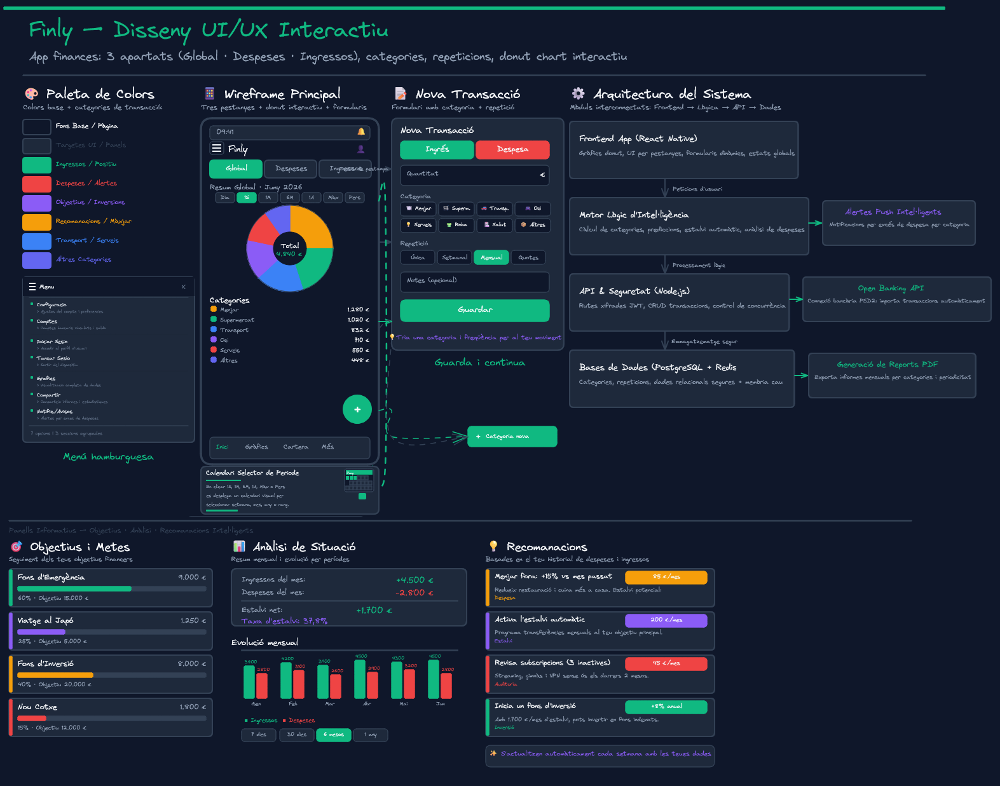

# Finly

App para gestionar ingresos y gastos personales con múltiples cuentas, categorías personalizables, filtros por período y gráficos visuales.



## Metodología

**Specification-Driven Development (SDD).** Las especificaciones están en `spec/` y son la única fuente de verdad. Primero se define qué construir, luego se implementa.

## Stack

| Capa | Tecnología |
|---|---|
| Framework | React Native con Expo |
| Lenguaje | TypeScript |
| Navegación | React Navigation (Stack + Drawer) |
| Gráficos | react-native-svg |
| Persistencia | SQLite (expo-sqlite) |
| Web | react-native-web |
| Estado | Context API |

## Cómo empezar

### Requisitos

- Node.js 18+
- npm

### Pasos

```bash
cd ControlGastos
npm install
npm run web
```

Esto abrirá la app en [http://localhost:8081](http://localhost:8081).

También puedes escanear el QR con **Expo Go** (app móvil gratuita) para verlo en el móvil.

### Otros comandos

| Comando | Descripción |
|---|---|
| `npm start` | Arranca Expo en modo desarrollo |
| `npm run web` | Arranca y abre en navegador |
| `npm run android` | Arranca en emulador Android |
| `npm run ios` | Arranca en simulador iOS (solo macOS) |

## Estructura del proyecto

```
ProyectoFinal/
├── ControlGastos/               ← App React Native / Expo
│   ├── App.tsx                  ← Punto de entrada
│   ├── app.json                 ← Configuración Expo
│   ├── src/
│   │   ├── components/          ← Componentes UI
│   │   │   ├── DonutChart.tsx
│   │   │   ├── BarChart.tsx
│   │   │   ├── CategoryList.tsx
│   │   │   ├── CalendarPicker.tsx
│   │   │   ├── AccountModal.tsx
│   │   │   ├── PeriodTabs.tsx
│   │   │   └── TypeTabs.tsx
│   │   ├── screens/             ← Pantallas
│   │   │   ├── HomeScreen.tsx
│   │   │   ├── AddTransaction.tsx
│   │   │   └── TransactionsScreen.tsx
│   │   ├── navigation/          ← Navegación
│   │   │   └── AppNavigator.tsx
│   │   ├── context/             ← Estado global
│   │   │   └── AppContext.tsx
│   │   ├── database/            ← Base de datos SQLite
│   │   │   ├── database.ts      ← Inicialización y migraciones
│   │   │   ├── types.ts         ← Interfaces de las tablas
│   │   │   ├── migrations/
│   │   │   │   └── 001_initial.ts
│   │   │   └── repositories/
│   │   │       ├── usuarioRepo.ts
│   │   │       ├── cuentaRepo.ts
│   │   │       ├── categoriaRepo.ts
│   │   │       ├── transaccionRepo.ts
│   │   │       ├── presupuestoRepo.ts
│   │   │       └── ahorroRepo.ts
│   │   ├── data/                ← Datos mock
│   │   │   └── mockData.ts
│   │   ├── storage/             ← Persistencia (legacy)
│   │   │   ├── storage.ts
│   │   │   └── migration.ts     ← Migración AsyncStorage → SQLite
│   │   ├── constants/           ← Constantes
│   │   │   └── colors.ts
│   │   └── utils/               ← Utilidades
│   │       └── formatters.ts
│   ├── assets/
│   ├── package.json
│   └── tsconfig.json
│
├── spec/                        ← Especificaciones SDD
│   └── features/
│       ├── 001-pagina-inicial/
│       └── 002-diseño-DB/
│
├── .agents/skills/              ← Skills para asistentes IA
├── docs/                        ← Documentación de conceptos
├── excalidraw/                  ← Diagramas y wireframes
├── AGENTS.md                    ← Reglas SDD globales
└── README.md                    ← Este archivo
```

## Funcionalidades

- Gestión de múltiples cuentas
- Registro de ingresos y gastos por categorías
- Filtros por período: Día, Semana, Mes, Año, Período personalizado
- Selector de fecha interactivo (DateTimePicker)
- Gráfico de anillos (donut) y barra horizontal apilada
- Desglose por categorías con porcentajes
- Tema oscuro
- Base de datos local SQLite con integridad referencial
- Presupuestos por categoría y período
- Planes de ahorro con objetivo y progreso
- Navegación con menú lateral (Drawer)
