# Finly

App para gestionar ingresos y gastos personales con múltiples cuentas, categorías personalizables, filtros por período y gráficos visuales.

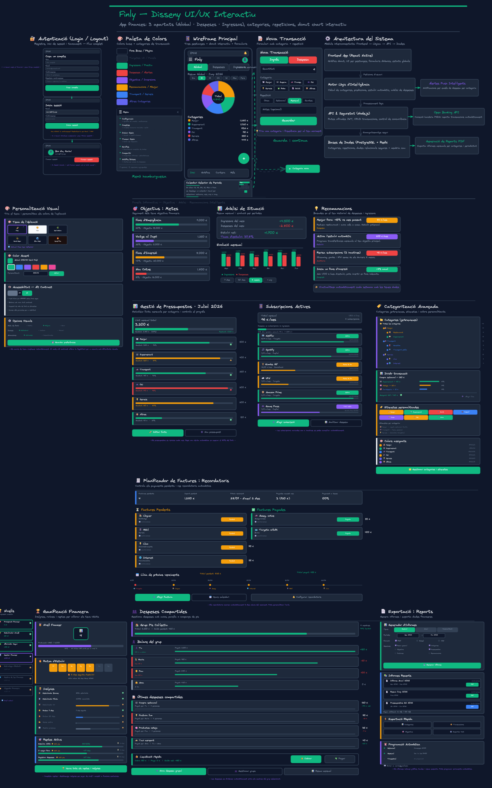

## Metodología

**Specification-Driven Development (SDD).** Las especificaciones están en `spec/` y son la única fuente de verdad. Primero se define qué construir, luego se implementa.

## Stack

| Capa | Tecnología |
|---|---|
| Framework | React Native con Expo (SDK 54) |
| Lenguaje | TypeScript |
| Navegación | React Navigation (Stack + Drawer) |
| Iconos | @expo/vector-icons (Ionicons) |
| Gráficos | react-native-svg |
| Color picker | reanimated-color-picker |
| Persistencia | SQLite (expo-sqlite) en nativo, localStorage en web |
| Web | react-native-web |
| Estado | Context API (AppContext + ConfigContext) |
| i18n | Sistema propio (español, inglés, catalán) |

## Cómo empezar

### Requisitos

- Node.js 18+
- npm
- Expo Go (app móvil gratuita) para verlo en el móvil

### Primera vez al clonar

```bash
cd FinlyApp
npm install
npx expo start
```

Esto arranca Metro Bundler. A partir de ahí:

| Para ver en… | Haz esto |
|---|---|
| **Navegador** | Abre [http://localhost:8081](http://localhost:8081) o ejecuta `npx expo start --web` |
| **Móvil (Expo Go)** | Pulsa la tecla **`s`** en la terminal y escanéa el QR con Expo Go |

> Si `expo` no se reconoce como comando, usa `npx expo ...` o `npm run web`.

### Notas importantes

- Este proyecto usa **Expo SDK 54** por compatibilidad con Expo Go. No actualices el SDK ni ejecutes `npm audit fix --force` (rompe las versiones).
- Si al escanear el QR en Expo Go no pasa nada, asegúrate de haber pulsado **`s`** para cambiar a modo Expo Go (el mensaje debe poner "Scan the QR code to open in Expo Go").
- Si da error `TurboModule method "installTurboModule"`, ejecuta:
  ```bash
  npx expo install react-native-worklets@0.5.1
  ```

### Otros comandos

| Comando | Descripción |
|---|---|
| `npm start` | Arranca Expo en modo desarrollo |
| `npm run web` | Arranca y abre en navegador |
| `npm run android` | Arranca en emulador Android |
| `npm run ios` | Arranca en simulador iOS (solo macOS) |

### Desarrollo por USB (sin red compartida)

Útil cuando el PC y el móvil no están en la misma red (ej. en clase).

**Requisitos previos:**
- Habilitar depuración USB en el móvil: Ajustes → Acerca del teléfono → tocar "Número de compilación" 7 veces → Ajustes → Opciones del desarrollador → activar "Depuración USB"
- Descargar `adb` (Android Debug Bridge):
  ```bash
  Invoke-WebRequest -Uri "https://dl.google.com/android/repository/platform-tools-latest-windows.zip" -OutFile "$env:TEMP\platform-tools.zip"
  Expand-Archive -Path "$env:TEMP\platform-tools.zip" -DestinationPath "C:\platform-tools" -Force
  ```
- Para que `adb` esté disponible globalmente, reiniciar la terminal después de la instalación.

**Pasos:**
1. Conectar el móvil al PC con cable USB
2. Reenviar el puerto con adb:
   ```bash
   C:\platform-tools\adb.exe reverse tcp:8081 tcp:8081
   ```
3. Arrancar Expo:
   ```bash
   npx expo start
   ```
4. En Expo Go: agitar el móvil → "Introducir URL manualmente" → escribir:
   ```
   exp://localhost:8081
   ```

### Desarrollo por USB Tethering (sin ADB, sin red compartida)

Alternativa cuando ADB no detecta el móvil (ej. drivers no instalados, cable sin datos).

**Requisito:** Datos móviles activos en el teléfono.

**Pasos:**
1. Conectar el móvil al PC con cable USB
2. En el móvil: **Ajustes → Conexiones → Zona WiFi compartida / USB tethering → activar "USB tethering"**
3. En el PC, arrancar Expo:
   ```bash
   npx expo start
   ```
4. Pulsar **`s`** para cambiar a modo Expo Go y escanear el QR

El PC navega a través de los datos del móvil, por lo que ambos dispositivos están en la misma red virtual. No requiere ADB ni `adb reverse`.

### Desarrollo por Tunnel (sin red compartida, sin cable)

```bash
npx expo start --tunnel
```
Requiere `@expo/ngrok` instalado globalmente (`npm install -g @expo/ngrok`). Funciona desde cualquier red pero es más lento.

## Estructura del proyecto

```
Finly/
├── FinlyApp/                    ← App React Native / Expo
│   ├── App.tsx                      ← Punto de entrada
│   ├── app.json                     ← Configuración Expo
│   ├── src/
│   │   ├── navigation/
│   │   │   └── AppNavigator.tsx     ← Stack + Drawer navigator
│   │   ├── screens/
│   │   │   ├── HomeScreen.tsx       ← Pantalla principal
│   │   │   ├── AddTransactionScreen.tsx ← Añadir gasto/ingreso
│   │   │   ├── AddCategoryScreen.tsx ← Seleccionar categoría
│   │   │   ├── TransactionsScreen.tsx ← Transacciones por categoría (014)
│   │   │   ├── AllTransactionsScreen.tsx ← Todas las transacciones (015)
│   │   │   ├── AccountsScreen.tsx   ← Lista de cuentas
│   │   │   ├── CreateAccountScreen.tsx ← Crear cuenta
│   │   │   ├── ModifyAccountScreen.tsx ← Editar cuenta
│   │   │   ├── CategoriesScreen.tsx ← Lista de categorías
│   │   │   ├── CreateCategoryScreen.tsx ← Crear categoría
│   │   │   ├── ModifyCategoryScreen.tsx ← Editar categoría
│   │   │   ├── TransactionDetailsScreen.tsx ← Detalles de transacción (016)
│   │   │   ├── ModifyTransactionScreen.tsx ← Modificar transacción (017)
│   │   │   └── SettingsScreen.tsx   ← Configuración de la app
│   │   ├── components/
│   │   │   ├── AccountModal.tsx     ← Modal de selección de cuentas
│   │   │   ├── AccountSelector.tsx  ← Trigger de selección de cuenta
│   │   │   ├── CalculatorModal.tsx  ← Calculadora emergente
│   │   │   ├── DonutChart.tsx       ← Gráfico de anillos SVG
│   │   │   ├── BarChart.tsx         ← Barra horizontal apilada
│   │   │   ├── CategoryList.tsx     ← Lista de desglose por categorías
│   │   │   ├── CategoryGrid.tsx     ← Grid 4×N de categorías
│   │   │   ├── ColorGrid.tsx        ← Selector de colores rápido
│   │   │   ├── ColorPickerModal.tsx ← Selector de color dinámico
│   │   │   ├── IconGrid.tsx         ← Grid de iconos
│   │   │   ├── SortToggle.tsx       ← Toggle de ordenación fecha/cantidad
│   │   │   ├── TransactionGroup.tsx ← Grupo de transacciones por fecha
│   │   │   ├── CalendarModal.tsx    ← Modal contenedor de calendarios
│   │   │   ├── CalendarPicker.tsx   ← Selector de fecha textual
│   │   │   ├── DaySelector.tsx      ← Selector de día (Hoy/Ayer/Dinámico)
│   │   │   ├── PeriodTabs.tsx       ← Tabs Día/Semana/Mes/Año/Período
│   │   │   ├── TypeTabs.tsx         ← Tabs Gastos/Ingresos
│   │   │   ├── SearchBar.tsx        ← Barra de búsqueda reutilizable
│   │   │   ├── TagSection.tsx       ← Sección de etiquetas
│   │   │   ├── CommentInput.tsx     ← Input de comentario con contador
│   │   │   ├── PhotoSection.tsx     ← Sección de foto (cámara/galería)
│   │   │   ├── SearchBar.tsx        ← Barra de búsqueda reutilizable
│   │   │   └── calendars/           ← Selectores de fecha
│   │   │       ├── DayPicker.tsx
│   │   │       ├── WeekPicker.tsx
│   │   │       ├── MonthGrid.tsx
│   │   │       ├── MonthNav.tsx
│   │   │       ├── YearGrid.tsx
│   │   │       ├── YearNav.tsx
│   │   │       ├── PeriodPicker.tsx
│   │   │       └── types.ts
│   │   ├── context/
│   │   │   ├── AppContext.tsx        ← Estado de negocio
│   │   │   └── ConfigContext.tsx     ← Preferencias del usuario
│   │   ├── database/
│   │   │   ├── database.ts          ← Inicialización SQLite + migraciones
│   │   │   ├── types.ts             ← Interfaces TypeScript
│   │   │   ├── index.ts             ← Switching por plataforma
│   │   │   ├── webStorage.ts        ← Fallback localStorage para web
│   │   │   ├── migrations/
│   │   │   │   ├── 001_initial.ts
│   │   │   │   ├── 002_seed.ts
│   │   │   │   ├── 003_config.ts
│   │   │   │   ├── 004_new_categories.ts
│   │   │   │   ├── 005_english_schema.ts
│   │   │   │   └── 006_account_description.ts
│   │   │   └── repositories/
│   │   │       ├── userRepo.ts
│   │   │       ├── accountRepo.ts
│   │   │       ├── categoryRepo.ts
│   │   │       ├── transactionRepo.ts
│   │   │       └── configRepo.ts
│   │   ├── i18n/
│   │   │   ├── index.ts             ← Selector de idioma + helpers
│   │   │   ├── en.ts
│   │   │   ├── es.ts
│   │   │   └── ca.ts
│   │   ├── hooks/
│   │   │   ├── useFontSize.ts       ← Hook de escalado de texto
│   │   │   └── useTransactionFilters.ts ← Filtrado y agrupación de transacciones
│   │   ├── constants/
│   │   │   ├── themes.ts            ← Paletas dark + light
│   │   │   ├── colors.ts            ← Paleta legacy
│   │   │   ├── types.ts             ← Tipos compartidos
│   │   │   ├── platformStyles.ts    ← Estilos por plataforma
│   │   │   └── accountIcons.ts      ← Iconos disponibles para cuentas
│   │   ├── data/
│   │   │   └── mockData.ts          ← Datos mock (legacy)
│   │   └── utils/
│   │       ├── calculator.ts        ← Evaluador de expresiones
│   │       └── formatters.ts        ← Formatear moneda, fechas, etc.
│   ├── assets/
│   ├── package.json
│   └── tsconfig.json
│
├── spec/                         ← Especificaciones SDD
│   ├── constitution/
│   └── features/
│       ├── 001-pagina-inicial/
│       ├── 002-diseño-DB/
│       ├── 003-pagina-configuracion/
│       ├── 004-pagina-anadir-transaccion/
│       ├── 005-pagina-anadir-categoria/
│       ├── 006-pagina-crear-categoria/
│       ├── 007-calculadora/
│       ├── 008-pagina-categorias/
│       ├── 009-pagina-modificar-eliminar-categoria/
│       ├── 010-app-logo/
│       ├── 011-pagina-cuentas/
│       ├── 012-pagina-modificar-eliminar-cuenta/
│       ├── 013-pagina-crear-cuenta/
│       ├── 014-pagina-transacciones-por-pagina-inicial/
│       ├── 015-pagina-transacciones-por-menu-hamburguesa/
│       ├── 016-pagina-detalles-transaccion/
│       └── 017-pagina-modificar-transaccion/
│
├── .agents/skills/               ← Skills para asistentes IA
├── docs/                         ← Documentación de conceptos
├── images/                       ← Diagramas y wireframes
├── AGENTS.md                     ← Reglas SDD globales
└── README.md                     ← Este archivo
```

## Funcionalidades

- Gestión de múltiples cuentas (crear, editar, eliminar)
- Registro de ingresos y gastos por categorías
- Listado y edición de categorías personalizadas con icono y color
- Filtros por período: Día, Semana, Mes, Año, Período personalizado
- Selector de fecha interactivo (DateTimePicker)
- Gráfico de anillos (donut) y barra horizontal apilada
- Desglose por categorías con porcentajes
- Selector de cuenta reutilizable con cálculo de saldos
- Ordenación de transacciones por fecha o cantidad
- Pantalla de todas las transacciones con filtros combinados
- Pantalla de detalles de transacción con eliminar y editar
- Pantalla de modificar transacción con datos precargados
- Pantalla de ajustes: tema, divisa, idioma, calendario, tamaño de texto
- Tema oscuro y claro con cambio en tiempo real
- Soporte multilingüe: español, inglés, catalán
- Escalado de texto según preferencias del usuario
- Navegación con menú lateral (Drawer)
- Calculadora básica integrada

## Screenshots

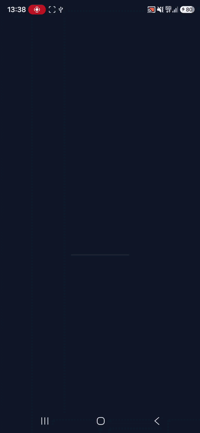<br>*Recorrido completo por la aplicación: pantalla principal, menú lateral, transacciones, ajustes y más.*<br><br>

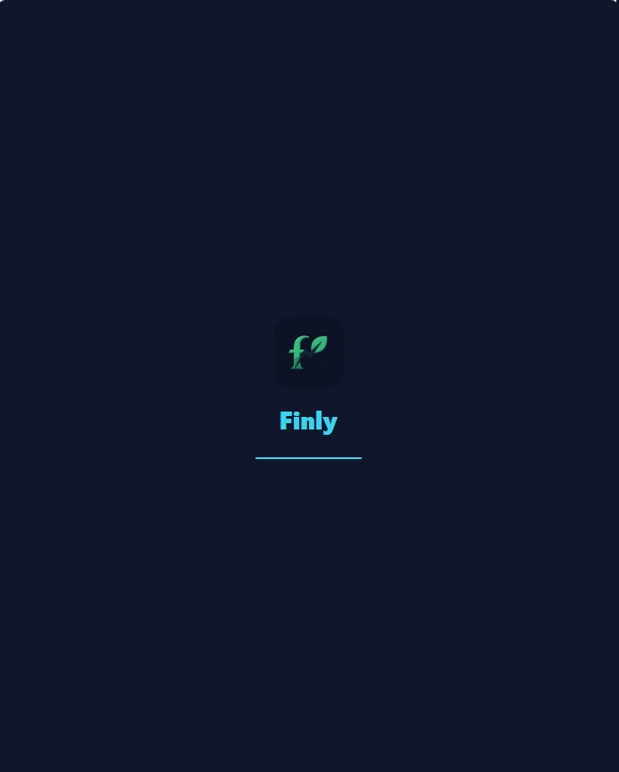<br>*Animación de carga con el logotipo de Finly y barra de progreso.*<br><br>
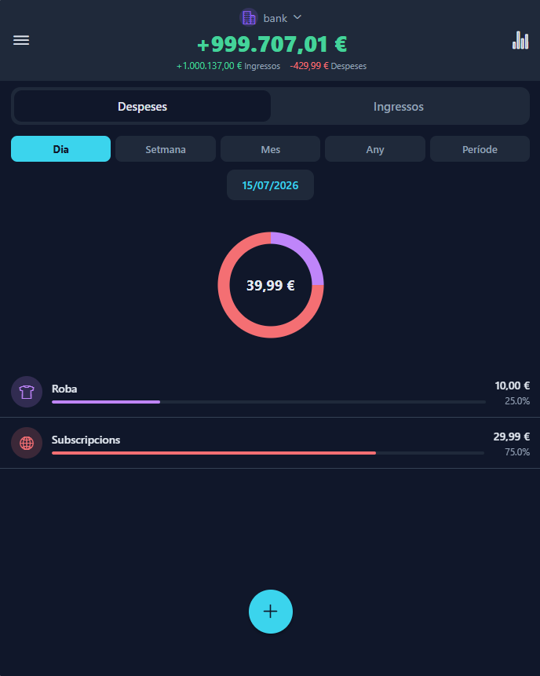<br>*Pantalla principal con selector de cuenta, saldo total, gráfico de anillos y desglose por categorías.*<br><br>
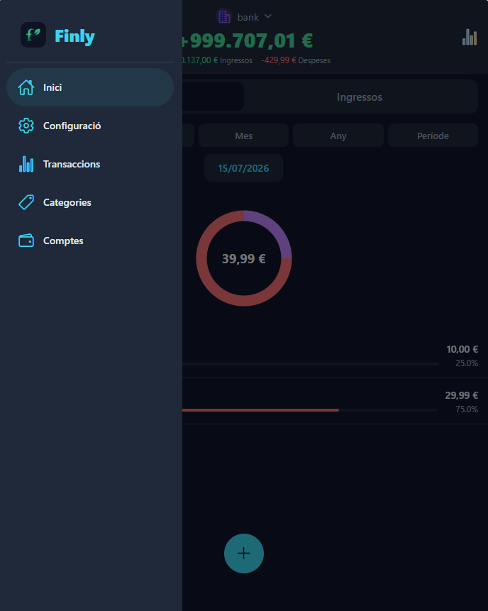<br>*Menú lateral (Drawer) con acceso a Inicio, Ajustes, Transacciones, Categorías y Cuentas.*<br><br>
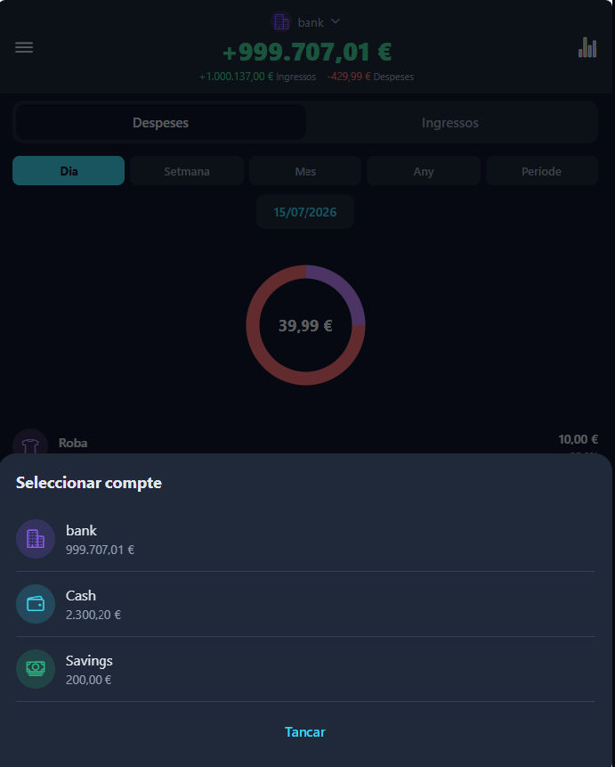<br>*Modal de selección de cuenta con icono, nombre y saldo disponible.*<br><br>
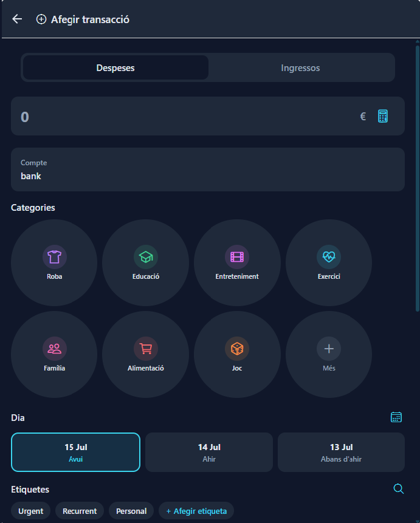<br>*Formulario para añadir un gasto o ingreso con cantidad, cuenta, categorías, día, etiquetas y comentario.*<br><br>
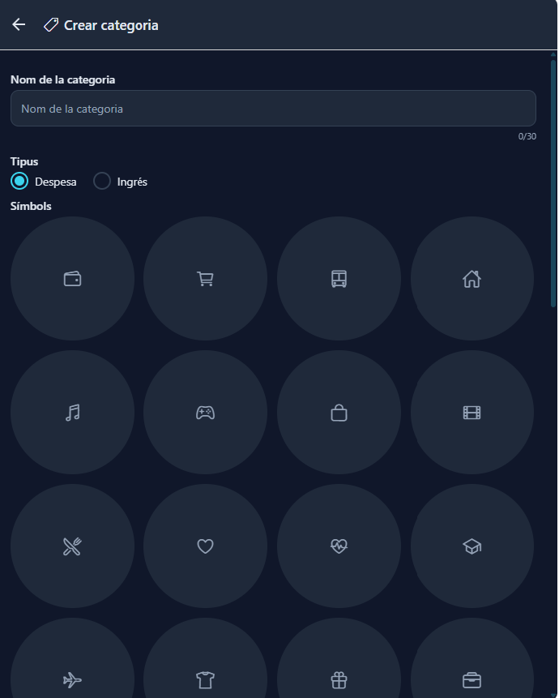<br>*Pantalla para crear una categoría personalizada con icono, color y nombre.*<br><br>
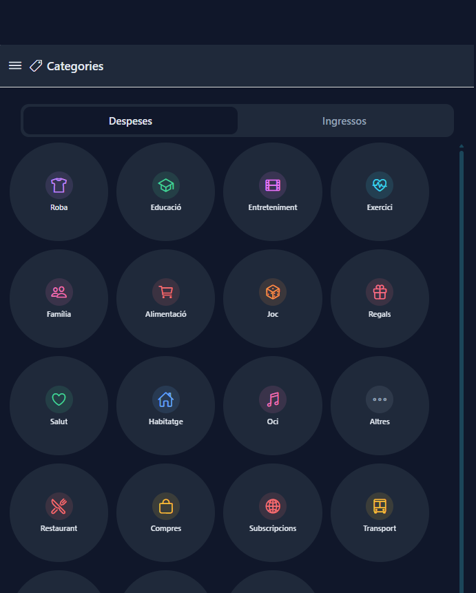<br>*Listado de categorías organizadas por tipo (gastos/ingresos) en un grid 4×N.*<br><br>
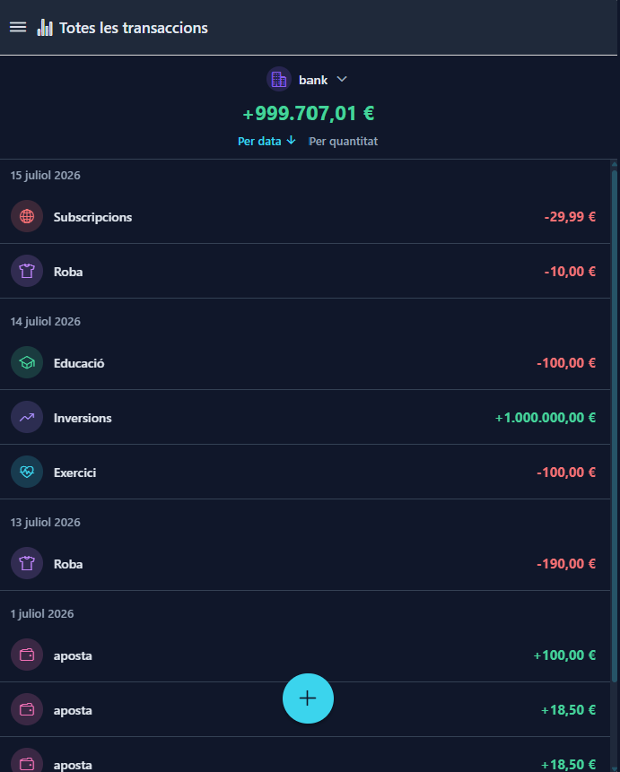<br>*Listado completo de todas las transacciones con selector de cuenta, ordenación y agrupación por día.*<br><br>
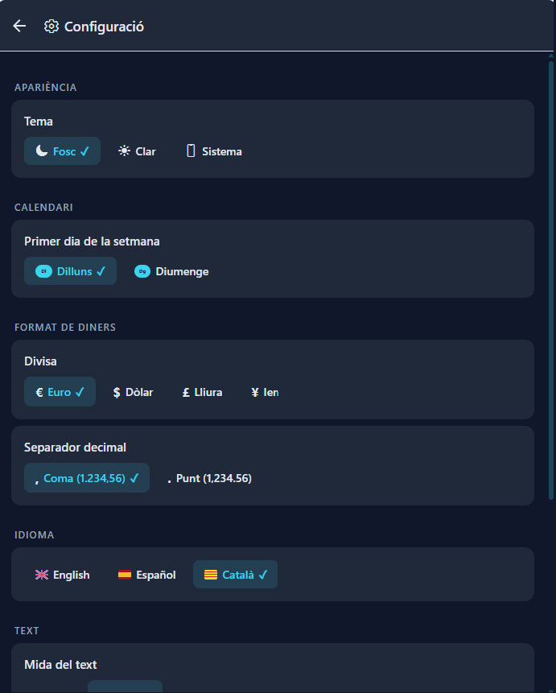<br>*Pantalla de ajustes con configuración de tema, divisa, idioma, tamaño de texto y forma de iconos.*<br><br>
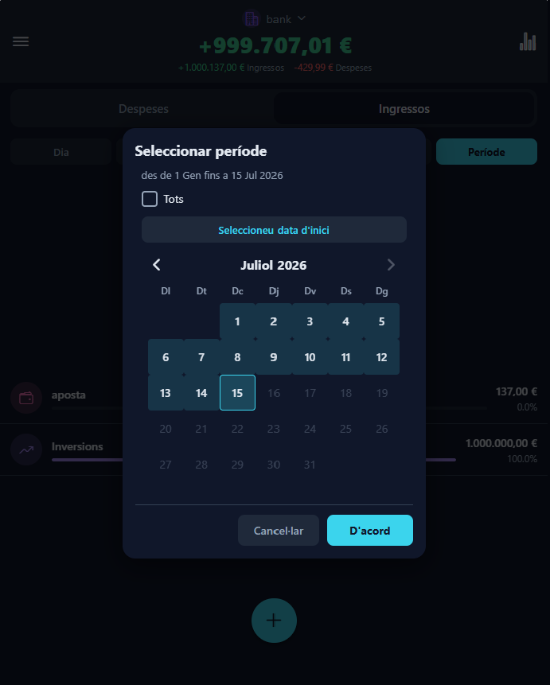<br>*Selector de período personalizado con calendario para elegir un rango de fechas.*
